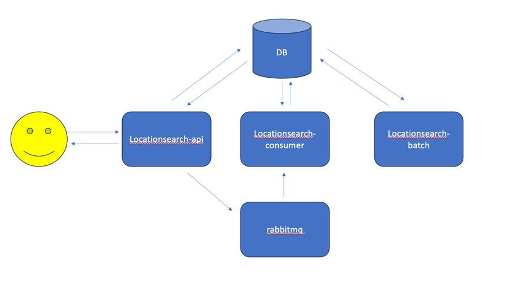

# Location Search Service

## 주요기능
"장소 검색 서비스"를 위한 서비스 API
1) 장소검색
2) 검색키워드목록


스펙
- Kotlin, java17, Spring Boot v3.2.4
- WebFlux, r2jdbc, jpa, RabbitMQ, MySQL8

## 모듈구성
### locationsearch-api
장소 검색 서비스 API
```
동시성을 위해 webflux를 사용하여 비동기적으로 외부 API 호출

GET /place
외부 API 호출을 하여 장소 검색 결과를 반환

curl --location 'http://127.0.0.1:8081/place?q=%EC%8A%A4%ED%83%80%EB%B2%85%EC%8A%A4%EA%B0%95%EB%82%A8%EC%A0%90'
{
    "keyword": "스타벅스강남점",
    "places": [
        {
            "title": "스타벅스뉴코아강남점"
        },
        {
            "title": "스타벅스압구정역점"
        },
        {
            "title": "스타벅스코엑스몰점"
        },
        {
            "title": "스타벅스강남r점"
        },
        {
            "title": "스타벅스대치점"
        },
        {
            "title": "스타벅스압구정점"
        }
    ]
}

GET /place/keyword/rank
키워드 검색에 따른 검색어 랭킹을 반환

curl --location 'http://127.0.0.1:8081/place/keyword/rank'
{
    "placeStats": [
        {
            "keyword": "coffee",
            "count": 6
        },
        {
            "keyword": "스타벅스강남점",
            "count": 5
        },
        {
            "keyword": "하나은행",
            "count": 3
        }
    ]
}
```


### locationsearch-batch
시스템 배치
```
검색에 따른 키워드 랭킹 집계 배치 스케쥴러
시간 기준으로 1분 전까지의 검색어 랭킹을 집계하여 DB에 저장 
- 개발기로 인하여 배치 스케쥴러는 1분으로 설정

```

### locaationsearch-conusumer
MQ -> DB적재
```
데이터 유실을 방지하기 위해 RabbitMQ를 사용하여 DB에 적재

locationsearch-api 에서 발생한 이벤트를 RabbitMQ에 전송
장소 검색에 발생된 이벤트 키워드를 DB에 적재
현재 MySQL에 적재 되어있지만 추후 대용량으로 진행시 nosql로 변경 예정
```


## Build
```bash
docker-compose build
```
## Run
```bash
docker-compose up
```

## 필수사항
```
KAKAO API KEY, NAVER API KEY 환경변수 추가 필요.
KAKAO_TOKEN=
NAVER_CLIENT_ID=
NAVER_CLIENT_SECRET=
```
